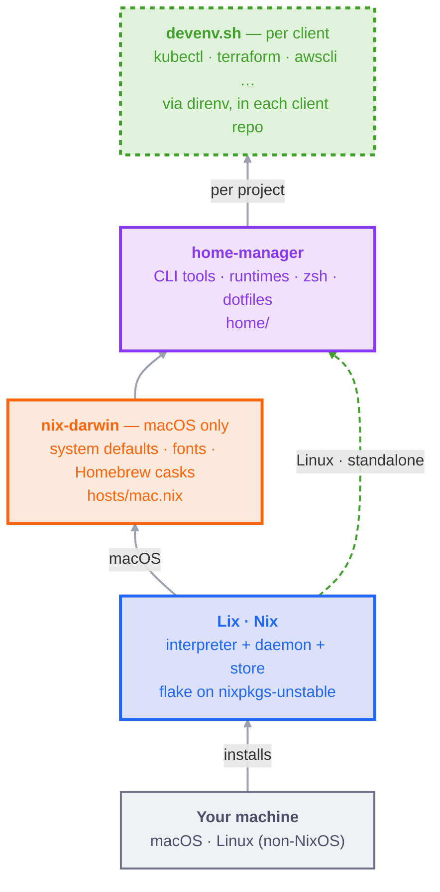

<div align="center">

# dotfiles

**A declarative, reproducible dev machine — one command, macOS or Linux.**

[](https://nixos.org)
[](https://lix.systems)
[](https://github.com/nix-darwin/nix-darwin)
[](https://github.com/nix-community/home-manager)
[](#bootstrap)
[](https://devenv.sh)

</div>

## Demo


> Recorded with [vhs](https://github.com/charmbracelet/vhs); regenerate with `nix run .#demo`.

## Architecture

Each layer **depends on the layer below it**. macOS gets the full stack; Linux
takes the same Nix → home-manager path and simply skips the macOS-only layer.



<details>
<summary><h2>Features</h2></summary>

- **One command, reproducible** — `bootstrap.sh` brings up the whole machine; idempotent and safe to re-run.
- **Cross-platform, one config** — identical CLI environment on macOS and non-NixOS Linux; Linux just skips the macOS GUI layer.
- **Nix-first** — every CLI and runtime from nixpkgs (unstable, latest versions); Homebrew only for GUI `.app`s nixpkgs lacks.
- **Dotfiles as code** — `~/.config/*` are read-only symlinks from the repo (nvim & Zed kept granular so they keep their own state).
- **Theme follows the OS** — Catppuccin Mocha (dark) / Latte (light); no switcher, no rebuild.
- **One-line tool changes** — add or remove a name in a single file, then re-apply.
- **Forkable** — the account is auto-detected; just swap the cask list and it's yours.
- **Client tools stay out** — kubectl/terraform/awscli live per-client in [devenv.sh](https://devenv.sh), never here.

</details>

<details>
<summary><h2>Why this — vs chezmoi · stow · mise</h2></summary>

Most dotfile tools manage **one slice** of a machine. This repo manages the whole
thing — dotfiles **and** CLIs **and** runtimes **and** macOS defaults **and** GUI
casks **and** fonts — from one declarative source, applied with one `switch`.

| Approach | Manages | Pins exact versions | Atomic + rollback | One config, macOS + Linux |
|---|---|---|---|---|
| **This repo** — Nix flake · home-manager · nix-darwin | dotfiles · CLIs · runtimes · macOS defaults · casks · fonts | ✅ `flake.lock` (whole closure) | ✅ generations | ✅ |
| **Plain dotfiles + Brewfile** | dotfiles (hand-rolled symlinks) · brew pkgs | ⚠️ "latest at install" | ❌ | ⚠️ manual branches |
| **GNU Stow** | dotfile symlinks only | ❌ no packages | ❌ | ⚠️ symlinks only |
| **chezmoi** | dotfiles (+ templates, secrets) | ❌ installs via imperative hooks | ❌ | ⚠️ dotfiles only |
| **mise / asdf** | per-project runtimes + tasks | ✅ per project, not the OS | ❌ | ⚠️ runtimes only |
| **Ansible / dotbot / yadm** | imperative convergence / symlinks | ❌ | ❌ | ⚠️ varies |

**Why Nix won here**

- **One model, not four.** Stow + a Brewfile + mise + a secrets tool ≈ what a
  single flake already does — minus the lockfile and the rollback.
- **Reproducible by construction.** `flake.lock` pins every input; the same lock
  rebuilds the same closure on any machine. Brew/chezmoi/mise pin loosely, or only
  per-project.
- **Atomic switch + rollback.** A failed `switch` doesn't half-apply, and a bad one
  rolls back to the previous generation. Imperative tools strand you mid-migration.
- **One config, two OSes.** The same home-manager layer builds on macOS and Linux.
- **Nothing scattered.** Tools live in the Nix store and compose into your profile —
  no drift in `/usr/local`. Per-project toolchains stay in [devenv.sh](https://devenv.sh).

**The honest cost** — Nix has the steepest learning curve of the bunch and a larger
store on disk, and GUI apps still come from Homebrew casks. The payoff: the machine
is a build artifact, not a pile of remembered steps.

**Where the others still fit** — `mise`/`devenv` shine at *per-project* runtimes;
this repo uses [devenv.sh](https://devenv.sh) for exactly that. chezmoi's templating
and secrets are deliberately out of scope — secrets stay in 1Password and client
config in a private devenv repo, never in the dotfiles.

</details>

<details>
<summary><h2>Repo structure</h2></summary>

```
dotfiles/
├── flake.nix             # inputs (unstable) + outputs (apps · checks · configs)
├── flake.lock            # pinned
├── username.nix          # the account to build for (stamped by bootstrap)
├── bootstrap.sh          # one command on a fresh machine, macOS or Linux
├── apply.sh              # rebuild wrapper behind `nix run .#mac|linux` — nom + nvd
├── Makefile              # task shortcuts: make apply · build · diff · update · lint
├── statix.toml           # Nix lint config (nix flake check)
├── nix/lib.nix           # flake helpers: mkDarwin · mkHome · lint · fmt
├── hosts/mac.nix         # macOS system layer + GUI casks
├── .github/              # demo (tape + gif) + CI (lint/fmt on push)
└── home/
    ├── shared.nix        # portable user core (zsh, direnv) — used by mac + linux
    ├── darwin.nix        # macOS-only layer: imports shared + GUI configs
    ├── linux.nix         # Linux-only layer: shared core + catppuccin theming
    ├── packages.nix      # nixpkgs CLI tools + runtimes + GUI editors
    ├── tmux.nix          # tmux via programs.tmux (plugins · status · sessions)
    ├── dotfiles.nix      # cross-platform dotfiles → read-only ~/.config symlinks
    ├── assets/           # wallpaper (catppuccin.heic)
    └── config/           # the actual dotfiles (shell/ nvim/ zed/ wezterm/ …)
```

</details>

<details>
<summary><h2>Bootstrap</h2></summary>

One command on a fresh machine. Idempotent — every layer is skipped if already
present, so it is safe to re-run.

```bash
curl -fsSL https://raw.githubusercontent.com/mhmdio/dotfiles/main/bootstrap.sh | bash
```

- **macOS** → Xcode CLT → Lix → Homebrew → clone → `darwin-rebuild switch`
- **Linux** (non-NixOS) → Lix → clone → `home-manager switch` (no system layer; the switch needs no sudo, though installing Lix + enrolling a trusted user does)

</details>

<details>
<summary><h2>Usage</h2></summary>

### What runs where

| Concern | Managed by |
|---|---|
| CLI tools + JS runtimes (node/bun) + GUI editors (Zed, WezTerm) | **nixpkgs** — `home/packages.nix` |
| zsh + plugins (autosuggestions, syntax-highlighting, fzf-tab), direnv | **home-manager** — `home/shared.nix` |
| Dotfiles (`~/.config/*`) imported as read-only symlinks | **home-manager** — `home/dotfiles.nix` → `home/config/` |
| macOS defaults, fonts, the user, system zsh *(macOS only)* | **nix-darwin** — `hosts/mac.nix` |
| macOS GUI configs (karabiner) | **home-manager** — `home/darwin.nix` |
| GUI `.app` casks (1Password, Chrome, Telegram, …) *(macOS only)* | **Homebrew**, driven declaratively by nix-darwin |
| Per-client toolchains (kubectl, terraform, …) | **devenv.sh** — *never in this repo* |

**Why Homebrew at all?** Almost everything is in Nix — even things that are
casks/taps elsewhere (`wezterm`, `_1password-cli`, `maple-mono`, the
`zed-editor` app). Only GUI apps with no good nixpkgs build remain on brew.

### Daily use

`nix run .#mac` / `.#linux` drive `apply.sh`, which stages tracked files for you
(flakes only see them) and shows the live build tree via
[nix-output-monitor](https://github.com/maralorn/nix-output-monitor); the build
log stays on screen (failed switches stay debuggable), and on macOS it prints an
`nvd` diff of what changed afterwards. Everything else is a plain Nix command.

```bash
# macOS
nix run .#mac      # apply.sh mac → sudo darwin-rebuild switch --flake .#mac
nix build --dry-run .#darwinConfigurations.mac.system   # evaluate, don't apply

# Linux
nix run .#linux    # apply.sh linux → home-manager switch --flake .#<you> -b backup

# native nix — run from anywhere
nix flake check    # lint + a real build of each config
nix fmt            # format every .nix file (nixfmt)
nix flake update   # bump flake.lock
nix run .#demo     # re-record the showcase gif (vhs · macOS only)
```

### nh — daily driver (Homebrew muscle-memory → Nix)

[`nh`](https://github.com/nix-community/nh) is a friendly front-end for the
build / search / garbage-collect loop (nom progress + a generation diff built
in). It's the closest thing to a daily `brew` replacement:

| Homebrew | here |
|---|---|
| `brew install foo` | add `foo` to `home/packages.nix` → `nh darwin switch` |
| `brew uninstall foo` | remove it from `home/packages.nix` → `nh darwin switch` |
| `brew search foo` | `nh search foo` |
| `brew upgrade` | `nix flake update` (bump `flake.lock`) → `nh darwin switch` |
| `brew cleanup` (+ autoremove) | `nh clean all` |

Point `nh` at this repo once so the subcommands need no path argument:

```bash
export NH_FLAKE="$HOME/Developer/dotfiles"   # adjust to your clone; add to your shell rc
```

```bash
nh darwin switch     # build + activate (sudo auto), live progress + change diff
nh search ripgrep    # find a package on nixpkgs
nh clean all         # garbage-collect old generations + the store
```

Two caveats: `nh` doesn't stage files, so run `git add -A` first (flakes only see
tracked files — `nix run .#mac` does this for you); and **GUI apps still come from
Homebrew casks** (declared in `hosts/mac.nix`) — `nh`/Nix manage the
CLI/Nix side, not casks.

`,` ([comma](https://github.com/nix-community/comma)) complements it: `, cowsay hi`
runs any nixpkg without installing it (run `nix-index` once to build its index).

### Adding / removing a tool

This is meant to be a one-line change.

- **A CLI or runtime** (any OS) → add/remove a name in `home/packages.nix`.
- **A macOS-only CLI** → `home/darwin.nix`.
- **A macOS GUI `.app`** → add/remove a cask in `hosts/mac.nix`.
- **A dotfile** → drop it in `home/config/<tool>/` and reference it in
  `home/dotfiles.nix` (or `home/darwin.nix` for macOS-only configs).

Then re-apply (`nix run .#mac` / `.#linux`). Search names at
[search.nixos.org/packages](https://search.nixos.org/packages).

</details>

<details>
<summary><h2>Packages</h2></summary>

Optional reference — every tool in [`home/packages.nix`](home/packages.nix) with a
one-line note (plus fonts from `hosts/mac.nix` and tmux from `home/tmux.nix`). GUI
`.app` casks: `homebrew.casks` in `hosts/mac.nix`.

**core shell / file utils**

| tool | what it is |
|---|---|
| [coreutils](https://www.gnu.org/software/coreutils/) | GNU core utilities |
| [gawk](https://www.gnu.org/software/gawk/) | GNU awk |
| [gnupg](https://gnupg.org) | OpenPGP encryption (GPG) |
| [curl](https://curl.se/) | transfer data over URLs |
| [wget](https://www.gnu.org/software/wget/) | download over HTTP/FTP |
| [rsync](https://rsync.samba.org/) | incremental file sync |
| [unzip](http://www.info-zip.org) | extract `.zip` archives |
| [p7zip](https://github.com/p7zip-project/p7zip) | 7-Zip archiver |

**search / nav / viewers**

| tool | what it is |
|---|---|
| [ripgrep](https://github.com/BurntSushi/ripgrep) | fast recursive grep |
| [fd](https://github.com/sharkdp/fd) | friendly `find` |
| [fzf](https://github.com/junegunn/fzf) | fuzzy finder |
| [zoxide](https://github.com/ajeetdsouza/zoxide) | smarter `cd` |
| [eza](https://github.com/eza-community/eza) | modern `ls` |
| [bat](https://github.com/sharkdp/bat) | `cat` + syntax highlighting |
| [yazi](https://github.com/sxyazi/yazi) | terminal file manager |

**git**

| tool | what it is |
|---|---|
| [git](https://git-scm.com/) | version control |
| [git-lfs](https://git-lfs.com/) | large-file storage |
| [gh](https://cli.github.com/) | GitHub CLI |
| [gh-dash](https://github.com/dlvhdr/gh-dash) | PR/issue dashboard TUI (`ghd`) |
| [lazygit](https://github.com/jesseduffield/lazygit) | git TUI |
| [delta](https://github.com/dandavison/delta) | syntax-highlighting diff pager |

**nix helpers**

| tool | what it is |
|---|---|
| [nix-output-monitor](https://github.com/maralorn/nix-output-monitor) | pretty live build progress (nom) |
| [nh](https://github.com/nix-community/nh) | nix CLI helper (rebuild/search/GC) |
| [nvd](https://khumba.net/projects/nvd) | package version diff |
| [comma](https://github.com/nix-community/comma) | run programs without installing |
| [nix-index](https://github.com/nix-community/nix-index) | files database for nixpkgs |

**dev runtimes / build**

| tool | what it is |
|---|---|
| [gcc](https://gcc.gnu.org/) | GNU compiler collection |
| [nodejs_24](https://nodejs.org) | Node.js 24 runtime |
| [bun](https://bun.sh) | JS runtime + bundler + PM |
| [pnpm](https://pnpm.io/) | fast JS package manager |
| [tree-sitter](https://github.com/tree-sitter/tree-sitter) | incremental parser |
| [devenv](https://github.com/cachix/devenv) | per-project dev shells (devenv.sh) |

**editor / multiplexer**

| tool | what it is |
|---|---|
| [neovim](https://neovim.io) | text editor |
| [tmux](https://tmux.github.io/) | terminal multiplexer |

**system / disk / containers**

| tool | what it is |
|---|---|
| [btop](https://github.com/aristocratos/btop) | resource monitor |
| [dust](https://github.com/bootandy/dust) | intuitive `du` |
| [duf](https://github.com/muesli/duf/) | disk usage / free |
| [gping](https://github.com/orf/gping) | ping with a graph |
| [lazydocker](https://github.com/jesseduffield/lazydocker) | docker TUI |
| [docker](https://www.docker.com/) | container CLI (talks to the colima VM) |
| [docker-compose](https://docs.docker.com/compose/) | multi-container orchestration |
| [colima](https://github.com/abiosoft/colima) | rootless Docker VM — replaces Docker Desktop (`colima start`) |

**data / http / net**

| tool | what it is |
|---|---|
| [jq](https://jqlang.github.io/jq/) | JSON processor |
| [jnv](https://github.com/ynqa/jnv) | interactive `jq` filter builder |
| [yq-go](https://mikefarah.gitbook.io/yq/) | YAML processor |
| [httpie](https://httpie.org/) | human-friendly HTTP client |
| [xh](https://github.com/ducaale/xh) | fast HTTP client (`curl`/`httpie`) |
| [doggo](https://github.com/mr-karan/doggo) | DNS client |
| [trippy](https://github.com/fujiapple852/trippy) | traceroute + ping TUI (`trip`) |
| [bandwhich](https://github.com/imsnif/bandwhich) | network usage by process |
| [rclone](https://rclone.org) | sync to/from cloud storage |

**power CLIs**

| tool | what it is |
|---|---|
| [pandoc](https://pandoc.org) | document converter |
| [killport](https://github.com/jkfran/killport) | kill the process on a port |
| [pwgen](https://github.com/tytso/pwgen) | password generator |
| [ast-grep](https://ast-grep.github.io/) | structural code search/rewrite |
| [scc](https://github.com/boyter/scc) | fast code counter |
| [starship](https://starship.rs) | shell prompt |
| [atuin](https://github.com/atuinsh/atuin) | shell history on Ctrl-R (SQLite, stats, sync) |
| [sd](https://github.com/chmln/sd) | `sed` alternative |
| [choose](https://github.com/theryangeary/choose) | human-friendly `cut`/`awk` |
| [viddy](https://github.com/sachaos/viddy) | modern `watch` |
| [hyperfine](https://github.com/sharkdp/hyperfine) | CLI benchmarking |
| [tealdeer](https://github.com/tealdeer-rs/tealdeer) | fast `tldr` pages |

**AI / agent**

| tool | what it is |
|---|---|
| [opencode](https://opencode.ai) | terminal AI coding agent |

**fetch / pretty**

| tool | what it is |
|---|---|
| [fastfetch](https://github.com/fastfetch-cli/fastfetch) | system info (neofetch-like) |
| [glow](https://github.com/charmbracelet/glow) | render markdown in the terminal |
| [gum](https://github.com/charmbracelet/gum) | shell-script UI toolkit |
| [hackernews-tui](https://github.com/aome510/hackernews-TUI) | Hacker News reader (`hn`) |

**recording / media**

| tool | what it is |
|---|---|
| [asciinema](https://asciinema.org/) | terminal session recorder |
| [ffmpeg](https://www.ffmpeg.org/) | audio/video convert & stream |
| [imagemagick](https://imagemagick.org/) | image convert & edit |

**GUI apps (from nixpkgs)**

| tool | what it is |
|---|---|
| [_1password-cli](https://developer.1password.com/docs/cli/) | 1Password CLI (`op`) |
| [wezterm](https://wezterm.org) | GPU terminal emulator |
| [zed-editor](https://zed.dev) | code editor (CLI: `zeditor`) |

**fonts & macOS extras (nix)**

| tool | what it is |
|---|---|
| [maple-mono](https://github.com/subframe7536/Maple-font) | Maple Mono NF — UI/editor font |
| [nerd-fonts](https://nerdfonts.com/) | Fira Code · Hack · JetBrains Mono |
| [mas](https://github.com/mas-cli/mas) | Mac App Store CLI |

</details>

<details>
<summary><h2>Fork</h2></summary>

**No username to set** — `bootstrap.sh` stamps the running account into
`username.nix`, which the flake reads (pure eval), so the same config builds for
any user on any machine with no manual edit. Just adjust the cask list in
`hosts/mac.nix` to taste. (Applying by hand instead of via bootstrap?
Put your account in `username.nix`; it defaults to `mohammed`.)

</details>

<details>
<summary><h2>Theme</h2></summary>

There is **no switcher command, no shell glue, and no custom theme files**. Each
tool detects the terminal's background colour and autoswitches **Catppuccin**
itself (Mocha = dark, Latte = light):

- **bat** → `--theme=auto` + `--theme-dark`/`--theme-light` (both ship with bat)
- **delta** → `detect-dark-light = auto`
- **btop** → built-in `TTY` theme (renders in the terminal's 16 ANSI colours)
- **nvim** → catppuccin `flavour = "auto"` (nvim detects the terminal background)
- **yazi** / **glow** → native dark/light auto-detection
- **WezTerm** & **Zed** detect the OS appearance natively
- **starship** uses one palette-agnostic config
- **wallpaper** → a dynamic `.heic` (Latte/Mocha) macOS switches with the appearance

WezTerm itself switches its Catppuccin Mocha/Latte palette with the OS, so the
16 ANSI colours everything reads also flip. Toggle the OS appearance — terminal
tools follow live, GUI apps on relaunch. No rebuild needed.

</details>

<details>
<summary><h2>⌨️ Keyboard shortcuts</h2></summary>

Two modifier **foundations**, set in Karabiner (`home/config/karabiner/karabiner.json`) on the Logitech MX Keys Mini — everything builds on these:

| Foundation | Keys | Role |
|---|---|---|
| **Hyper** | Right Option → `⌃⌥⇧⌘` | Global namespace — app launch + window/space actions (bound in Raycast's GUI). No app uses all four mods, so nothing collides. |
| **Caps → Ctrl** | hold `Caps` = `Ctrl`, double-tap = `Esc` | The comfortable Ctrl for the terminal/editor (tmux, nvim, zsh vi-mode). |

### WezTerm — leader `Ctrl+Shift+a` (= Caps+Shift+a)

| Keys | Action |
|---|---|
| `⌘P` | command palette — incl. a tmux session switcher (Leader `?` aliases it) |
| Leader `-` / `\|` | split down / right |
| Leader `h j k l` · Leader `⇧ hjkl` | focus pane · resize pane |
| Leader `r` | resize mode (then `hjkl`, `Esc`) |
| Leader `Space` · `f` · `=` · `o` · `q` | pane picker · zoom · swap · rotate · close |
| Leader `t` · `[` `]` · `1`–`9` · `Tab` | new tab · prev/next · jump N · last |
| Leader `w` · `{` `}` · `$` | workspace switcher · prev/next · rename |
| Leader `Enter` / `s` · `y` / `v` · `/` | copy-mode / quick-select · copy / paste · search |
| Leader `m` · `⇧ f` · `⇧ r` | launcher (btop/yazi/lazygit) · fullscreen · reload |

Source: `home/config/wezterm/wezterm.lua`.

### tmux — prefix `Ctrl+b`

| Keys | Action |
|---|---|
| Prefix `\|` / `-` | split horizontal / vertical (keep path) |
| Prefix `h j k l` · Prefix `⇧ HJKL` | select pane · resize |
| Prefix `r` | reload config |
| copy-mode `v` / `y` | begin selection / copy (vi) |

Source: `home/config/tmux/tmux.conf`.

### Neovim — leader `Space`

Stock **LazyVim** keymaps (no repo overrides); `Space` opens which-key. See the [LazyVim keymaps](https://www.lazyvim.org/keymaps).

### Yazi & Lazygit

- **Yazi**: `g i` → lazygit; otherwise stock vi-style nav. (`home/config/yazi/keymap.toml`)
- **Lazygit**: stock defaults. (`home/config/lazygit/config.yml`)

### Shell — zsh vi-mode + fzf

| Keys | Action |
|---|---|
| `Ctrl+R` | shell history search (Atuin — SQLite, stats, exit codes, optional sync) |
| `Ctrl+T` · `Alt+C` | insert file/dir path · cd into a dir |
| `Tab` | fzf-tab completion (with previews) |
| `Esc` (or double-tap Caps) · `v` | vi normal mode · edit command in `$EDITOR` |
| `Ctrl+A/E` · `Ctrl+K/U/W` · `Ctrl+Y` | line start/end · kill line/line-back/word · yank |

Aliases: `ls`→eza · `cat`→bat · `lt` tree · `cd`→zoxide · `y` yazi-cd · `v`/`n` nvim · `lg` lazygit · `hn` Hacker News · `g` + git shorthands. Type **`help`** for a colour cheatsheet of the modern-CLI replacements. Source: `home/config/shell/*.zsh`.

</details>

<details>
<summary><h2>Notes</h2></summary>

- **nixpkgs-unstable** across nixpkgs / nix-darwin / home-manager (latest tool versions).
- **`nix.enable = false`** — Lix owns Nix; nix-darwin doesn't manage the daemon.
- **`allowUnfree = true`** — for the 1Password CLI, etc.
- **Scope = your daily tools only.** Per-client CLIs are out of scope by design —
  they belong in [devenv.sh](https://devenv.sh) shells, not here.
- **Homebrew casks are declarative** (zap-prune on activation) — a cask installed by
  hand but not added to `hosts/mac.nix` is removed on the next `nix run .#mac`.
- **Wallpaper** — first `nix run .#mac` may prompt to allow controlling System Events
  (so it can set the desktop picture); approve once.

</details>

<details>
<summary><h2>Roadmap</h2></summary>

**Coverage** — OSes the config targets

- [x] macOS
- [x] Linux (non-NixOS)
- [ ] WSL2 — via [NixOS-WSL](https://github.com/nix-community/NixOS-WSL) (full NixOS,
  not standalone home-manager); see the commented `nixosConfigurations.wsl` in `flake.nix`

**Test** — verified end-to-end on a fresh machine

- [x] macOS
- [ ] Linux
- [ ] WSL2

</details>

<details>
<summary><h2>Links</h2></summary>

**Nix layer**
- [Lix](https://lix.systems) — the Nix interpreter/daemon this repo installs
- [nix-darwin options](https://nix-darwin.github.io/nix-darwin/manual/) — every `system.defaults` / system key
- [home-manager options](https://nix-community.github.io/home-manager/options.xhtml) — user-layer options
- [search.nixos.org/packages](https://search.nixos.org/packages) — find a package name
- [MyNixOS — nix-darwin](https://mynixos.com/nix-darwin/options/system.defaults) — searchable defaults reference

**Per-client toolchains**
- [devenv.sh](https://devenv.sh) — per-project reproducible shells
- [direnv](https://direnv.net) — auto-loads a shell on `cd`

**Tools**
- [WezTerm](https://wezterm.org) · [Neovim](https://neovim.io) / [LazyVim](https://www.lazyvim.org) · [Yazi](https://yazi-rs.github.io) · [lazygit](https://github.com/jesseduffield/lazygit) · [tmux](https://github.com/tmux/tmux/wiki)
- [Starship](https://starship.rs) · [zoxide](https://github.com/ajeetdsouza/zoxide) · [fzf](https://github.com/junegunn/fzf) · [fzf-tab](https://github.com/Aloxaf/fzf-tab) · [eza](https://eza.rocks) · [bat](https://github.com/sharkdp/bat) · [ripgrep](https://github.com/BurntSushi/ripgrep) · [fd](https://github.com/sharkdp/fd) · [delta](https://github.com/dandavison/delta)

**Theme**
- [Catppuccin](https://catppuccin.com) — the Mocha/Latte palette every tool follows

</details>
