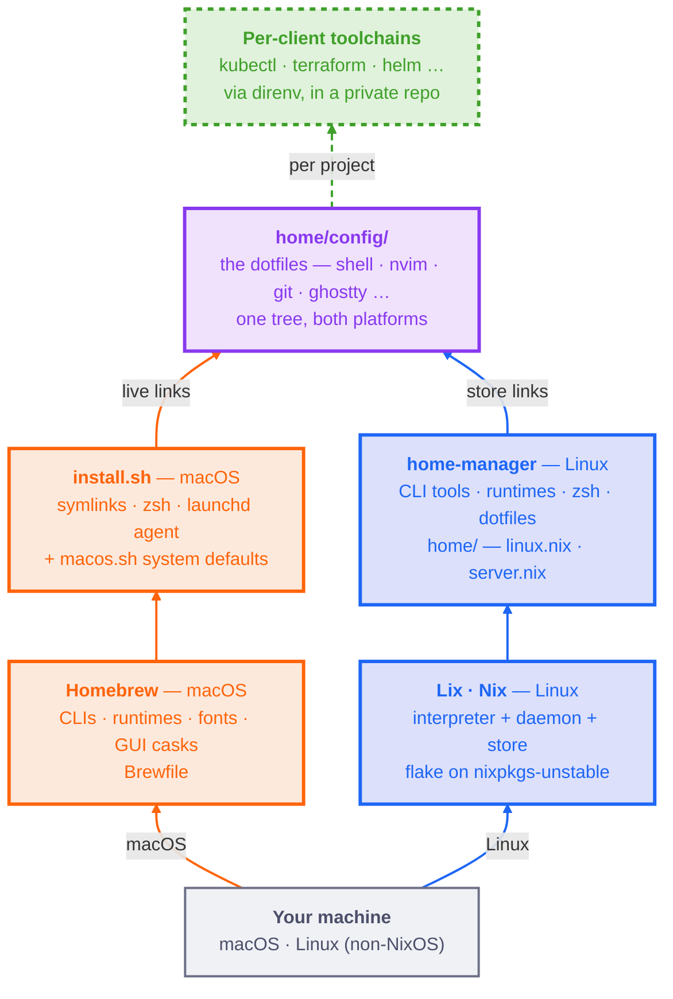
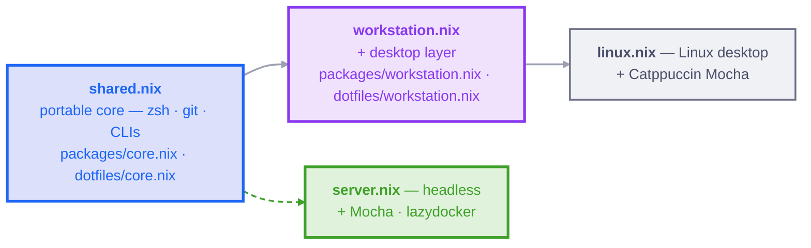

<div align="center">

# dotfiles

**One command to a set-up dev machine — Homebrew on macOS, Nix on Linux.**

[](https://brew.sh)
[](https://nixos.org)
[](https://lix.systems)
[](https://github.com/nix-community/home-manager)
[](#bootstrap)

</div>

## Demo


> Recorded with [vhs](https://github.com/charmbracelet/vhs); regenerate with `make demo` (`brew install vhs` first).

## Architecture

Two paths up from the machine, **one set of dotfiles** at the top. The Mac runs on
**Homebrew**: the `Brewfile` installs every CLI, runtime, font and GUI app, and
`install.sh` symlinks `home/config/*` straight into `~/.config` — live links into
the checkout, so there is no build step — with `macos.sh` for the system defaults.
Linux keeps the **Lix → home-manager** path, where a pinned, rollback-able closure
pays for itself on a box nobody sits at. Both land the same `home/config/` tree, so
the shell, keybinds and tool configs match. A headless box takes the Linux path with
a slimmer profile — see [Profiles](#profiles) below.


```mermaid
flowchart BT
    HW["`**Your machine**
    macOS · Linux (non-NixOS)`"]
    BREW["`**Homebrew** — macOS
    CLIs · runtimes · fonts · GUI casks
    Brewfile`"]
    INST["`**install.sh** — macOS
    symlinks · zsh · launchd agent
    + macos.sh system defaults`"]
    NIX["`**Lix · Nix** — Linux
    interpreter + daemon + store
    flake on nixpkgs-unstable`"]
    HM["`**home-manager** — Linux
    CLI tools · runtimes · zsh · dotfiles
    home/ — linux.nix · server.nix`"]
    CFG["`**home/config/**
    the dotfiles — shell · nvim · git · ghostty …
    one tree, both platforms`"]
    DEV["`**Per-client toolchains**
    kubectl · terraform · helm …
    via direnv, in a private repo`"]

    HW   -->|"macOS"| BREW
    BREW --> INST
    HW   -->|"Linux"| NIX
    NIX  --> HM
    INST -->|"live links"| CFG
    HM   -->|"store links"| CFG
    CFG  -->|"per project"| DEV

    classDef base   fill:#eff1f5,stroke:#6c6f85,stroke-width:2px,color:#4c4f69;
    classDef brew   fill:#fde9dc,stroke:#fe640b,stroke-width:3px,color:#fe640b;
    classDef nix    fill:#dce0fb,stroke:#1e66f5,stroke-width:3px,color:#1e66f5;
    classDef home   fill:#f0e2fd,stroke:#8839ef,stroke-width:3px,color:#8839ef;
    classDef client fill:#e0f2db,stroke:#40a02b,stroke-width:3px,color:#40a02b,stroke-dasharray:5 5;

    class HW base;
    class BREW,INST brew;
    class NIX,HM nix;
    class CFG home;
    class DEV client;

    linkStyle 0,1,4 stroke:#fe640b,stroke-width:2px;
    linkStyle 2,3,5 stroke:#1e66f5,stroke-width:2px;
    linkStyle 6 stroke:#40a02b,stroke-width:2px,stroke-dasharray:6 4;
```

### Profiles

The Linux side is **two home-manager entry points over one shared core**, so the
same shell, keybinds and dotfiles land on a desktop and on a server the size of a
CAX11. Where you add a package decides how far it travels:


```mermaid
flowchart LR
    SH["`**shared.nix**
    portable core — zsh · git · CLIs
    packages/core.nix · dotfiles/core.nix`"]
    WS["`**workstation.nix**
    + desktop layer
    packages/workstation.nix · dotfiles/workstation.nix`"]
    LIN["`**linux.nix** — Linux desktop
    + Catppuccin Mocha`"]
    SRV["`**server.nix** — headless
    + Mocha · lazydocker`"]

    SH  --> WS
    WS  --> LIN
    SH  -.-> SRV

    classDef core   fill:#dce0fb,stroke:#1e66f5,stroke-width:3px,color:#1e66f5;
    classDef desk   fill:#f0e2fd,stroke:#8839ef,stroke-width:3px,color:#8839ef;
    classDef leaf   fill:#eff1f5,stroke:#6c6f85,stroke-width:2px,color:#4c4f69;
    classDef server fill:#e0f2db,stroke:#40a02b,stroke-width:3px,color:#40a02b;

    class SH core;
    class WS desk;
    class LIN leaf;
    class SRV server;

    linkStyle 0,1 stroke:#9ca0b0,stroke-width:2px;
    linkStyle 2 stroke:#40a02b,stroke-width:2px,stroke-dasharray:6 4;
```

| Profile | Apply with | Flake output |
|---|---|---|
| **macOS** — `Brewfile` + `install.sh` | `make apply` (`./install.sh`) | none — no Nix on the Mac |
| `home/linux.nix` | `make apply` (`nix run .#linux`) | `homeConfigurations.<you>` · `<you>-aarch64` |
| `home/server.nix` | `nix run .#server` — no make target | `homeConfigurations.<serverUser>-server` · `-aarch64` |

The Mac sits outside this graph: its `Brewfile` mirrors the workstation set section
for section, and `install.sh` links the same `home/config/` tree. A package added to
`packages/workstation.nix` reaches the Linux desktop only — the Mac wants its own
`Brewfile` line.

The headless profile importing `shared.nix` **directly** is the whole
distinction — no Zed/1Password, no colima VM, no node/bun/pnpm, no media
toolchain. Adding a tool to `packages/workstation.nix` therefore never grows the
server closure; you opt in from `server.nix`, on purpose. Both Linux profiles are
built for `x86_64` and `aarch64`, so a Hetzner box works whichever it is.

<details>
<summary><h2>Features</h2></summary>

- **One command** — `bootstrap.sh` brings up the whole machine; idempotent and safe to re-run.
- **Cross-platform, one config** — the same `home/config/` shell, keybinds and tool configs on macOS, non-NixOS Linux, and headless servers; only the package manager underneath differs.
- **Homebrew on the Mac, Nix on Linux** — every Mac CLI, runtime, font and GUI app is one line in the `Brewfile` (upstream-current, no rebuilds); Linux desktops and servers keep a pinned nixpkgs-unstable closure through home-manager.
- **Dotfiles as code** — on the Mac, `~/.config/*` are live, writable symlinks into the checkout, so an edit applies the moment it's saved (nvim linked file by file; lazygit & Zed get writable copies because they rewrite their own config). On Linux, home-manager links them read-only from the store.
- **Theme follows the OS** — Catppuccin Mocha (dark) / Latte (light); no switcher, no rebuild.
- **One-line tool changes** — add or remove a line in the `Brewfile` (Mac) or a name in one `.nix` file (Linux), then `make apply`.
- **Forkable** — nothing account-specific on the Mac; just swap the casks in the `Brewfile` and it's yours.
- **Client tools stay out** — kubectl, terraform and friends live per client in a private repo (a Homebrew `Brewfile` each, plus a direnv `envrc` for the env vars and helper scripts), never here. (`awscli` is the one deliberate exception: agents call `aws` directly.)

</details>

<details>
<summary><h2>Why this — vs chezmoi · stow · mise</h2></summary>

This repo used to be Nix end to end — nix-darwin + home-manager on the Mac too —
on the argument that one flake beats Stow + a Brewfile + mise. On Linux that still
holds. On the Mac it stopped paying for itself.

**Why the Mac left Nix.** Every change was a rebuild, the store grew to ~36 GB, GUI
apps came from Homebrew casks anyway, fast-moving tools lagged upstream in nixpkgs,
and a `/nix/store` binary can't self-update. That's a lot of time, disk and friction
for reproducibility a single laptop rarely cashes in. So the Mac is now a `Brewfile`
plus plain symlinks: installs are fast, packages are upstream-current, and a dotfile
edit is live the moment it's saved — nothing to build or switch.

**The trade-off** — no lockfile and no rollback on the Mac. Versions are "latest at
install", `brew upgrade` moves them, and a bad upgrade is fixed by hand. For a
machine you sit in front of, an easy trade.

**Why Linux keeps Nix.** A headless box is where reproducibility earns its keep:
`flake.lock` pins the whole closure, a switch is atomic with generations behind it,
and the homelab repo's Ansible role builds the server profile from this flake,
unattended.

| | macOS | Linux · servers |
|---|---|---|
| Packages | Homebrew — `Brewfile` | nixpkgs-unstable — `home/packages/` |
| Dotfiles | live, writable symlinks (`install.sh`) | home-manager, read-only from the store |
| Pinned versions | ⚠️ "latest at install" | ✅ `flake.lock` (whole closure) |
| Rollback | ❌ | ✅ generations |
| A dotfile edit applies | instantly — it's a symlink | on the next switch |
| System defaults | `macos.sh` | — |

**Where the others fit** — the Mac half is now roughly *Stow + a Brewfile*, with a
short `install.sh` in place of Stow because a few configs need a writable copy, a
generated file or a launchd agent. chezmoi's templating and secrets are deliberately
out of scope — secrets stay in 1Password, client config in a private repo. mise/asdf
shine at per-project runtimes; here that job goes to a per-client Brewfile + direnv.

</details>

<details>
<summary><h2>Repo structure</h2></summary>

```
dotfiles/
├── Brewfile              # macOS: every CLI, runtime, font and GUI cask (brew bundle)
├── install.sh            # macOS: brew bundle + live symlinks into ~ and ~/.config + launchd agent
├── macos.sh              # macOS: system defaults — Dock, Finder, keyboard, trackpad, Spotlight keys
├── bootstrap.sh          # one command on a fresh machine, macOS or Linux
├── Makefile              # the entry point: make apply · home · update · … (detects the platform)
├── flake.nix             # Linux: inputs (unstable) + outputs (apps · checks · home configs)
├── flake.lock            # pinned
├── username.nix          # the account the Linux flake builds for (stamped by bootstrap)
├── apply.sh              # Linux: rebuild wrapper behind `nix run .#linux|server` — nom progress
├── statix.toml           # Nix lint config (nix flake check)
├── nix/lib.nix           # flake helpers: mkHome · lint · fmt
├── wallpaper/            # mac/ dynamic .heic (shuffled) + iphone/ png
├── .github/              # demo (tape + gif) + CI (lint · fmt · workflow tests · eval, on push and PRs)
├── tests/                # workflow regression suite (make test)
├── .sops.yaml            # sops recipients (Linux sops-nix)
└── home/
    ├── zsh/              # macOS ~/.zshenv · .zprofile · .zshrc (linked by install.sh)
    ├── bin/              # macOS helpers — wallpaper-shuffle (the launchd agent's script)
    ├── shared.nix        # Linux: portable user core (zsh, direnv) — the floor every profile stands on
    ├── workstation.nix   # shared + the desktop layer — imported by linux.nix
    ├── linux.nix         # Linux desktop entry point: workstation + Mocha
    ├── server.nix        # headless entry point: shared + Mocha, no desktop weight
    ├── theme-mocha.nix   # catppuccin/nix Mocha — Linux side only; the Mac autoswitches
    ├── packages/         # nixpkgs tools — core.nix (everywhere) + workstation.nix (desktop)
    ├── dotfiles/         # → read-only ~/.config symlinks on Linux, split the same core/workstation way
    └── config/           # the actual dotfiles, both platforms (shell/ nvim/ zed/ ghostty/ …)
        └── shell/path.zsh  # PATH order for both: opencode > GNU gnubin > Homebrew > system
```

</details>

<details>
<summary><h2>Bootstrap</h2></summary>

One command on a fresh machine. Re-runs skip installed prerequisites, refresh
the checkout, and apply it again. Refresh refuses tracked edits, untracked files,
or local commits; only the auto-stamped root `username.nix` is exempt. Commit/push
local work or use `git stash -u` before re-running. `DOTFILES_FORCE_RESET=1`
explicitly bypasses this protection and can discard local work.

```bash
curl -fsSL https://raw.githubusercontent.com/mhmdio/dotfiles/main/bootstrap.sh | bash
```

- **macOS** → Xcode CLT → Homebrew → clone → `./install.sh` (Brewfile + links) → `./macos.sh` (system defaults). No Nix. Touch ID for `sudo` and disabling Guest login are root-owned, so they stay one-time manual one-liners, listed at the bottom of `macos.sh`.
- **Linux** (non-NixOS) → Lix → clone → `home-manager switch` (no system layer; the switch needs no sudo, though installing Lix + enrolling a trusted user does)
- **Headless** → *not* this script. Once Lix and the clone exist, the no-desktop
  profile is `nix run .#server` — it supplies the pinned Home Manager CLI, so no
  separate CLI installation is needed. Normally driven by the homelab repo's
  Ansible dotfiles role, not by hand. (Running `bootstrap.sh` on a server would apply the
  *desktop* Linux profile, which is exactly the weight `server.nix` exists to avoid.)

</details>

<details>
<summary><h2>Usage</h2></summary>

### What runs where

| Concern | macOS | Linux |
|---|---|---|
| CLI tools | **Homebrew** — `Brewfile` | **nixpkgs** — `home/packages/core.nix` (servers too) |
| Runtimes (node/bun/pnpm/uv), containers, media | **Homebrew** — `Brewfile` | **nixpkgs** — `home/packages/workstation.nix` (desktops only) |
| GUI `.app`s + fonts | **Homebrew** casks — `Brewfile` | — |
| zsh entry points + plugins, direnv | `home/zsh/` (linked by `install.sh`) + brew's zsh plugins | **home-manager** — `home/shared.nix` |
| PATH order | `home/config/shell/path.zsh` | the same file |
| Dotfiles (`~/.config/*`) | **live, writable symlinks** — `install.sh` → `home/config/` | **read-only symlinks** — `home/dotfiles/` → `home/config/` |
| macOS defaults (Dock, Finder, keyboard, trackpad) | `macos.sh` | — |
| Shuffled wallpaper | launchd agent from `install.sh` → `home/bin/wallpaper-shuffle` | — |
| Per-client toolchains (kubectl, terraform, …) | private `Brewfile` per client (installed globally) + a direnv `envrc` for env vars and `bin/` helpers — *never in this repo* | — (the server does no client work) |

**Why two package managers?** On the Mac, Homebrew is what the ecosystem ships for:
upstream-current formulae, every GUI cask, the fonts — no build step, and a tool
with its own updater (codex, opencode, claude) can actually update itself. Linux
boxes, servers above all, get more from Nix: a locked closure the homelab's Ansible
role can rebuild unattended. The tool lists mirror each other on purpose (same
sections in `Brewfile` and `home/packages/`), so the shell feels the same on both.
`brew bundle` is additive: it installs what's missing and never removes anything, so
a `brew install` you never declared stays until `make outdated` flags it and you
prune it (`brew bundle cleanup --force`).

### Daily use — `make`

**`make` is the interface.** The host-specific targets detect macOS vs Linux
themselves, so the same command works on either. Run `make` on its own for the list.

```bash
make            # list every target (with the detected host)
make apply      # ← the one you want: install packages + apply configs on this host
make home       # configs only — no package changes
make update     # upgrade EVERYTHING (see below)
```

**`make apply` vs `make home`.** On the Mac, `make apply` is `./install.sh`:
`brew bundle --no-upgrade` (installs whatever the Brewfile lists that's missing,
upgrades nothing), then the symlinks, the writable lazygit/Zed copies, the generated
gh-dash configs, gh's config + the gh-dash extension, the docker CLI-plugin dir and
the wallpaper agent. `make home` is `./install.sh --no-brew` — the same minus
Homebrew, seconds not minutes. Neither needs sudo (a few cask installers ask for a
password on first install). For a plain dotfile edit you need neither: the links
point into the checkout, so a saved change is already live. Run `make home` after
adding a `link` line to `install.sh` or to re-seed the lazygit/Zed copies from the
repo; `make apply` after editing the `Brewfile`. `make macos` re-applies `macos.sh`
— only needed on a fresh Mac or after changing a value there, since the preference
plists persist on their own.

On Linux both are a home-manager switch — `make apply` through `apply.sh` (stages
new files, nom progress, `-b backup`), `make home` calling `home-manager switch`
directly — and new packages and dotfile edits alike need one.

**`make update` does more than upgrade packages.** On the Mac it's `brew update &&
brew upgrade` — upgrades land in place, there is no separate apply. On Linux it's
`nix flake update`; follow it with `make apply` to switch. Either way the nvim plugin
pins move too — `lazy-lock.json` links into the checkout, so the bump lands in
`git diff` (on Linux, right next to `flake.lock`):

| | |
|---|---|
| `flake.lock` *(Linux)* | nixpkgs · home-manager · catppuccin · nix-index-database · sops-nix |
| `home/config/nvim/lazy-lock.json` *(both)* | via `nvim --headless '+Lazy! update'` |

Reaching for `brew upgrade` or `nix flake update` by hand silently skips the plugin
pass, and those pins drift quietly. On Linux, narrow it with `make update I=nixpkgs` —
naming a single input updates *only* that input and deliberately skips the plugin pass.

| Inspect | |
|---|---|
| `make outdated` | **macOS** — `brew outdated`, then a `brew bundle cleanup` dry run: what's installed but not in the `Brewfile` |
| `make diff` | **Linux** — build, then `nvd` what would change vs the running home env — **the pre-flight for `apply`** |
| `make build` | **Linux** — build without activating (leaves `./result`) |
| `make generations` | **Linux** — list past home-manager generations |
| `make check` | **Linux** — `nix flake check`: lint, fmt, workflow tests, and the home + server configs build |
| `make lint` · `make fmt` | **Linux** — fast statix check, no build · format every `.nix` (nixfmt) |
| `make test` | **Linux** — isolated bootstrap/apply/shell regressions, including first-run CLI wiring; no activation |

On a Mac the Nix targets (`make linux` included) print a "Linux-only" pointer
instead of failing on a missing `nix`.

The workflow suite lives in `tests/test_workflows.py` and runs in CI too. It uses
throwaway homes and Git repositories, the real packaged Home Manager drivers,
and fake Nix build commands—no network access or real profile activation. For
script-only checks without Nix, run `python3 tests/test_workflows.py` with Git,
Bash and Zsh installed (the packaged-app test is skipped).

| Recover / reclaim | |
|---|---|
| `make rollback` | **Linux** — home-manager has no one-shot rollback; points you at `make generations`. (The Mac has none — see *Why this* above.) |
| `make gc` | macOS: `brew cleanup --prune=all` · Linux: drop old generations, collect garbage, optimise the store |
| `make cleanup` | docker prune **plus** go/brew/pnpm caches (+ the Nix GC on Linux) |
| `make clean` | just remove `./result` symlinks |

| Setup | |
|---|---|
| `make bootstrap` | fresh machine / full re-provision (`./bootstrap.sh`) |
| `make macos` | re-apply the macOS defaults (`./macos.sh`) |
| `make demo` | re-record the README showcase gif (`vhs .github/demo.tape`; needs `brew install vhs`) |

Plus three you rarely type: `make help` (what bare `make` runs), `make switch`
(alias for `apply`), and `make linux` — `nix run .#linux` with the host pinned
instead of detected.

<details>
<summary>What <code>make apply</code> is wrapping</summary>

The targets are thin wrappers. On the Mac that's `./install.sh` and `./macos.sh` —
run them directly whenever you like. On Linux the flake apps stay the source of
truth — reach for these when you want to be explicit, or on a box where `make apply`
would guess wrong (a headless server auto-detects as `linux`, which is the *desktop*
profile — use `nix run .#server` there).

```bash
./install.sh             # macOS: brew bundle --no-upgrade + links + agents
./install.sh --no-brew   # macOS: links only
nix run .#linux          # apply.sh linux  → home-manager switch --flake .#<you> -b backup
nix run .#server         # apply.sh server → home-manager switch --flake .#<serverUser>-server

nix build --dry-run .#homeConfigurations.<you>.activationPackage   # evaluate, don't apply
```

`apply.sh` stages changes, including new files, in ordinary clones and linked Git
worktrees (flakes only see tracked files). A staging failure stops the apply.
The Linux desktop and server apps both carry the flake-pinned Home Manager CLI.
The wrapper shows the live build
tree via [nix-output-monitor](https://github.com/maralorn/nix-output-monitor), and keeps
the build log on screen so a failed switch stays debuggable.

</details>

### nh and `,` — Linux only

`make` covers the daily loop; on Linux, [`nh`](https://github.com/nix-community/nh)
is a friendly front-end for the same build / search / garbage-collect operations
(nom progress + a generation diff built in). Point it at this repo once:

```bash
export NH_FLAKE="$HOME/Developer/dotfiles"   # adjust to your clone; add to your shell rc
nh home switch       # build + activate, live progress + change diff
nh search ripgrep    # find a package on nixpkgs
nh clean all         # garbage-collect old generations + the store
```

`nh` doesn't stage files, so run `git add -A` first (flakes only see tracked files —
`make apply` does this for you).

`,` ([comma](https://github.com/nix-community/comma)) complements it: `, cowsay hi`
runs any nixpkg without installing it, and an unknown command suggests exactly that.
The lookup database is not built locally —
[nix-index-database](https://github.com/nix-community/nix-index-database) is a
flake input pinned in `flake.lock`, so `,` works on a fresh box with nothing
to run by hand, and `make update` refreshes the index along with everything else.

None of this exists on the Mac: there you use `brew` directly (`brew search`,
`brew install`, then record it in the `Brewfile`), and a missing command gets zsh's
plain "command not found".

### Adding / removing a tool

This is meant to be a one-line change.

**macOS**

- **A CLI, runtime or font** → a `brew "…"` line (fonts: `cask "font-…"`) in `Brewfile`,
  then `make apply`. Or `brew install x` first and record it in the `Brewfile`
  after — `make outdated` lists anything installed but undeclared.
- **A GUI `.app`** → a `cask "…"` line in `Brewfile`.
- **A dotfile** → drop it in `home/config/<tool>/` and add a `link` line to
  `install.sh` (`put` instead for an app that rewrites its own config), then
  `make home`. A new file inside an already-linked directory (`shell/`, `git/`) is
  live with no step at all.
- **Removing** → delete the line and `brew uninstall` it — nothing is removed for you.

**Linux**

- **A CLI you want everywhere**, servers included → `home/packages/core.nix`.
- **A CLI or runtime for machines you sit at** → `home/packages/workstation.nix`
  (the Linux desktop; the headless profile never sees it). **Server-only** → `home/server.nix`.
- **A dotfile** → drop it in `home/config/<tool>/` and reference it in
  `home/dotfiles/core.nix` (or `dotfiles/workstation.nix` for desktop-only).

Then `make apply` (or `make home` if it was only a dotfile). Search names at
[search.nixos.org/packages](https://search.nixos.org/packages). A tool you want on
both platforms is two lines: one in the `Brewfile`, one in `home/packages/`.

</details>

<details>
<summary><h2>Packages</h2></summary>

Optional reference — every tool in [`home/packages/`](home/packages) (the Linux
side) with a one-line note. The Mac's [`Brewfile`](Brewfile) mirrors it section for
section, plus the fonts and GUI `.app` casks; where the two differ, the `Brewfile`
is what the Mac actually gets.

Everything below is in [`core.nix`](home/packages/core.nix) and lands on every
Linux profile, servers included — **except the *(desktop)* ones**, which live in
[`workstation.nix`](home/packages/workstation.nix) and never reach a headless box.

**core shell / file utils**

| tool | what it is |
|---|---|
| [coreutils](https://www.gnu.org/software/coreutils/) | GNU core utilities |
| [gawk](https://www.gnu.org/software/gawk/) | GNU awk |
| [gnupg](https://gnupg.org) | OpenPGP encryption (GPG) |
| [curl](https://curl.se/) | transfer data over URLs |
| [wget](https://www.gnu.org/software/wget/) | download over HTTP/FTP |
| [rsync](https://rsync.samba.org/) | incremental file sync |
| [unzip](http://www.info-zip.org) | extract `.zip` archives |
| [p7zip](https://github.com/p7zip-project/p7zip) | 7-Zip archiver |

**search / nav / viewers**

| tool | what it is |
|---|---|
| [ripgrep](https://github.com/BurntSushi/ripgrep) | fast recursive grep |
| [fd](https://github.com/sharkdp/fd) | friendly `find` |
| [fzf](https://github.com/junegunn/fzf) | fuzzy finder |
| [zoxide](https://github.com/ajeetdsouza/zoxide) | smarter `cd` |
| [eza](https://github.com/eza-community/eza) | modern `ls` |
| [bat](https://github.com/sharkdp/bat) | `cat` + syntax highlighting |

**git**

| tool | what it is |
|---|---|
| [git](https://git-scm.com/) | version control |
| [git-lfs](https://git-lfs.com/) | large-file storage |
| [gh](https://cli.github.com/) | GitHub CLI (via `programs.gh`) |
| [gh-dash](https://github.com/dlvhdr/gh-dash) | PR/issue dashboard — `gh` extension, run `gh dash` (`ghd`) |
| [lazygit](https://github.com/jesseduffield/lazygit) | git TUI |
| [lazyworktree](https://github.com/chmouel/lazyworktree) | git worktree manager TUI (`lwt`) *(Linux only — not on Homebrew)* |
| [delta](https://github.com/dandavison/delta) | syntax-highlighting diff pager |

**nix helpers** *(Linux only — the Mac has no Nix)*

| tool | what it is |
|---|---|
| [nix-output-monitor](https://github.com/maralorn/nix-output-monitor) | pretty live build progress (nom) |
| [nh](https://github.com/nix-community/nh) | nix CLI helper (rebuild/search/GC) |
| [nvd](https://khumba.net/projects/nvd) | package version diff |
| [comma](https://github.com/nix-community/comma) | run programs without installing |
| [nix-index](https://github.com/nix-community/nix-index) | files database for nixpkgs |

**dev runtimes / build**

| tool | what it is |
|---|---|
| [gcc](https://gcc.gnu.org/) | GNU compiler collection |
| [nodejs_24](https://nodejs.org) | Node.js 24 runtime *(desktop)* |
| [bun](https://bun.sh) | JS runtime + bundler + PM *(desktop)* |
| [pnpm](https://pnpm.io/) | fast JS package manager *(desktop)* |
| [tree-sitter](https://github.com/tree-sitter/tree-sitter) | incremental parser |
| [uv](https://docs.astral.sh/uv/) | Python installer/runner; `uvx` for one-off tools *(desktop)* |

**editor**

| tool | what it is |
|---|---|
| [neovim](https://neovim.io) | text editor |

**system / disk / containers**

| tool | what it is |
|---|---|
| [btop](https://github.com/aristocratos/btop) | resource monitor |
| [dust](https://github.com/bootandy/dust) | intuitive `du` |
| [duf](https://github.com/muesli/duf/) | disk usage / free |
| [gping](https://github.com/orf/gping) | ping with a graph |
| [lazydocker](https://github.com/jesseduffield/lazydocker) | docker TUI *(desktop)* |
| [docker](https://www.docker.com/) | container CLI (talks to the colima VM) *(desktop)* |
| [docker-compose](https://docs.docker.com/compose/) | multi-container orchestration *(desktop)* |
| [colima](https://github.com/abiosoft/colima) | rootless Docker VM — replaces Docker Desktop (`colima start`) *(desktop)* |

**data / http / net**

| tool | what it is |
|---|---|
| [jq](https://jqlang.github.io/jq/) | JSON processor |
| [jnv](https://github.com/ynqa/jnv) | interactive `jq` filter builder |
| [fx](https://github.com/antonmedv/fx) | interactive JSON viewer / processor |
| [yq-go](https://mikefarah.gitbook.io/yq/) | YAML processor |
| [httpie](https://httpie.org/) | human-friendly HTTP client |
| [xh](https://github.com/ducaale/xh) | fast HTTP client (`curl`/`httpie`) |
| [posting](https://github.com/darrenburns/posting) | API client TUI — terminal Postman (`posting`) *(desktop)* |
| [doggo](https://github.com/mr-karan/doggo) | DNS client |
| [trippy](https://github.com/fujiapple852/trippy) | traceroute + ping TUI (`trip`) |
| [bandwhich](https://github.com/imsnif/bandwhich) | network usage by process |
| [rclone](https://rclone.org) | sync to/from cloud storage |

**power CLIs**

| tool | what it is |
|---|---|
| [pandoc](https://pandoc.org) | document converter |
| [killport](https://github.com/jkfran/killport) | kill the process on a port |
| [pwgen](https://github.com/tytso/pwgen) | password generator |
| [ast-grep](https://ast-grep.github.io/) | structural code search/rewrite |
| [scc](https://github.com/boyter/scc) | fast code counter |
| [starship](https://starship.rs) | shell prompt |
| [atuin](https://github.com/atuinsh/atuin) | shell history on Ctrl-R (SQLite, stats, sync) |
| [sd](https://github.com/chmln/sd) | `sed` alternative |
| [choose](https://github.com/theryangeary/choose) | human-friendly `cut`/`awk` |
| [viddy](https://github.com/sachaos/viddy) | modern `watch` |
| [hyperfine](https://github.com/sharkdp/hyperfine) | CLI benchmarking |
| [tealdeer](https://github.com/tealdeer-rs/tealdeer) | fast `tldr` pages |

**AI / agent**

Not in nixpkgs on purpose — claude, opencode and codex each ship their own
self-updating installer, so pinning them to a flake would freeze them until the
next `make update`. (On the Mac, codex is a `Brewfile` cask instead.) `ai-update` drives each one's updater and `cc` / `oc` / `cx`
run them with permissions bypassed (`home/config/shell/ai.zsh`). Worktrees are
plain `git worktree add`.

**fetch / pretty**

| tool | what it is |
|---|---|
| [fastfetch](https://github.com/fastfetch-cli/fastfetch) | system info (neofetch-like) |
| [glow](https://github.com/charmbracelet/glow) | render markdown in the terminal |
| [gum](https://github.com/charmbracelet/gum) | shell-script UI toolkit |
| [hackernews-tui](https://github.com/aome510/hackernews-TUI) | Hacker News reader (`hn`) *(Linux desktop only — not on Homebrew)* |
| [bagels](https://github.com/EnhancedJax/Bagels) | expense tracker TUI (`bagels`) *(desktop)* |
| [harlequin](https://harlequin.sh/) | SQL IDE for the terminal (`harlequin`) *(desktop)* |

**cloud**

| tool | what it is |
|---|---|
| [awscli2](https://aws.amazon.com/cli/) | `aws` CLI — called directly by agents *(desktop)* |
| [cloudlens](https://github.com/one2nc/cloudlens) | k9s-like TUI for AWS/GCP (`cloudlens`) *(Linux desktop only — not on Homebrew)* |

**secrets**

Credentials themselves live in 1Password (`op`); these are for secrets committed
to a repo encrypted.

| tool | what it is |
|---|---|
| [age](https://github.com/FiloSottile/age) | modern file encryption |
| [sops](https://github.com/getsops/sops) | encrypted files with age keys |
| [sops-nix](https://github.com/Mic92/sops-nix) | decrypts them into place at activation |

`.sops.yaml` names the age recipients allowed to decrypt; the private key sits at
`~/.config/sops/age/keys.txt`, is gitignored, and **is not reproducible from this
repo** — back it up, or a fresh machine can restore every config except these.

Nothing is encrypted yet, and the module is inert until something is: its config
is `mkIf (secrets != {})`, so importing it adds no activation step. Adding the
first secret is two lines in `home/shared.nix` —

```nix
sops.defaultSopsFile = ../secrets/secrets.yaml;   # created by: sops secrets/secrets.yaml
sops.secrets.some-token = { };                    # → ~/.config/sops-nix/secrets/some-token
```

**recording / media**

| tool | what it is |
|---|---|
| [asciinema](https://asciinema.org/) | terminal session recorder |
| [ffmpeg](https://www.ffmpeg.org/) | audio/video convert & stream *(desktop)* |
| [imagemagick](https://imagemagick.org/) | image convert & edit *(desktop)* |
| [yt-dlp](https://github.com/yt-dlp/yt-dlp) | video/audio downloader (YouTube + 1000s of sites) *(desktop)* |

**GUI apps (from nixpkgs; casks on the Mac)**

| tool | what it is |
|---|---|
| [_1password-cli](https://developer.1password.com/docs/cli/) | 1Password CLI (`op`) *(desktop)* |
| [zed-editor](https://zed.dev) | code editor (CLI: `zeditor`) *(desktop)* |

**fonts & macOS extras (`Brewfile`)**

| tool | what it is |
|---|---|
| [maple-mono](https://github.com/subframe7536/Maple-font) | Maple Mono NF — UI/editor font |
| [nerd-fonts](https://nerdfonts.com/) | Hack |
| [mas](https://github.com/mas-cli/mas) | Mac App Store CLI |

</details>

<details>
<summary><h2>Fork</h2></summary>

**No username to set.** On the Mac nothing is account-specific — `install.sh`
works off `$HOME` — so forking is adjusting the `Brewfile` (the casks especially)
and the pinned Dock apps in `macos.sh` to taste. On Linux, `bootstrap.sh` stamps the
running account into `username.nix`, which the flake reads (pure eval), so the same
config builds for any user on any machine with no manual edit. (Applying by hand
instead of via bootstrap? Put your account in `username.nix`; it defaults to `mohammed`.)

</details>

<details>
<summary><h2>Theme</h2></summary>

**No switcher command and no rebuild.** Almost every tool detects the terminal's
background colour and autoswitches **Catppuccin** itself (Mocha = dark, Latte =
light):

- **bat** → `--theme=auto` + `--theme-dark`/`--theme-light` (both ship with bat)
- **delta** → `detect-dark-light = auto`
- **btop** → the terminal's own 16 ANSI colours, so it never needs a flavour
- **nvim** → catppuccin `flavour = "auto"` (nvim detects the terminal background)
- **spf** / **glow** → native dark/light auto-detection
- **Ghostty** & **Zed** detect the OS appearance natively
- **starship** uses one palette-agnostic config
- **wallpaper** → dynamic `.heic`s, each carrying its own light and dark image (see [Thanks](#thanks))

Ghostty itself switches its Catppuccin Mocha/Latte palette with the OS (`theme = light:…,dark:…`), so the
16 ANSI colours everything reads also flip. Toggle the OS appearance — terminal
tools follow live, GUI apps on relaunch.

**One exception, and it's deliberate: [gh-dash](https://github.com/dlvhdr/gh-dash).**
It can't autoswitch — its config takes one colour per role, and lipgloss flattens
adaptive colours to concrete RGB before they reach the terminal, so a configured
ANSI index never survives. It ships two theme files
(`home/config/gh-dash/theme-{mocha,latte}.yml`, appended to a shared base by
`install.sh` on the Mac and at build time on Linux) and the `ghd` shell function reads `AppleInterfaceStyle` to pick one at
launch. That's the only shell glue and the only hand-written theme in the repo.
Two honest limits: the flavour is chosen when the dashboard starts, so it won't
follow a switch mid-session, and plain `gh dash` (rather than `ghd`) always gets
Mocha.

The Linux profiles skip all of this and pin Mocha through
[catppuccin/nix](https://github.com/catppuccin/nix) (`home/theme-mocha.nix`) —
there's no OS appearance to follow over SSH.

</details>

<details>
<summary><h2>⌨️ Keyboard shortcuts</h2></summary>

Two modifier **foundations**, set in Karabiner (`home/config/karabiner/karabiner.json`) on the Logitech MX Keys Mini — everything builds on these:

| Foundation | Keys | Role |
|---|---|---|
| **Hyper** | Right Option → `⌃⌥⇧⌘` | Global namespace — app launch + window/space actions (bound in Raycast's GUI). No app uses all four mods, so nothing collides. |
| **Caps → Ctrl** | `Caps` = `Ctrl`, held or tapped | The comfortable Ctrl for the terminal/editor (nvim, zsh vi-mode). A plain remap — a double-tap-for-Esc rule fires on the ordinary Ctrl-Ctrl of a game and pauses it. |

### Ghostty

Deliberately thin — and now the whole story: there is no multiplexer, so Ghostty
owns tabs, splits and window state itself. The config sets a font and a theme and
otherwise leaves every default alone:

| Keys | Action |
|---|---|
| `⌘T` · `⌘⇧[` / `⌘⇧]` · `⌃⇥` | new tab · previous / next · cycle |
| `⌘1..8` | jump to tab |
| `⌘D` / `⇧⌘D` · `⌘[` / `⌘]` | split right / down · move between splits |
| `⌘W` | close the split (or the tab, if it's the last one) |

The trade for dropping the multiplexer: **nothing survives closing the window.**
Long jobs want `nohup`, a launchd agent, or a terminal left open. Appearance follows macOS through one line
(`theme = light:Catppuccin Latte,dark:Catppuccin Mocha`) with no wrapper and no
restart, and `macos-titlebar-style = hidden` keeps the chrome out of the way.

Source: `home/config/ghostty/config` — validate edits with `ghostty +validate-config`.

### Neovim — leader `Space`

Stock **LazyVim** keymaps plus a few rebinds: `Ctrl-h/j/k/l` navigates nvim splits, `<leader>_` opens superfile as a file picker (`--chooser-file`, see `lua/config/keymaps.lua`). `Space` opens which-key. See the [LazyVim keymaps](https://www.lazyvim.org/keymaps).

### superfile & Lazygit

- **superfile** (`spf`): `e` opens the file in nvim, `z` the zoxide jump modal, `Q` quits and cd's the shell there. (`home/config/superfile/config.toml`)
- **Lazygit**: stock defaults. (`home/config/lazygit/config.yml`)

### Shell — zsh vi-mode + fzf

| Keys | Action |
|---|---|
| `Ctrl+R` | shell history search (Atuin — SQLite, stats, exit codes, optional sync) |
| `Ctrl+T` · `Alt+C` | insert file/dir path · cd into a dir |
| `Tab` | fzf-tab completion (with previews) |
| `Esc` · `v` | vi normal mode · edit command in `$EDITOR` |
| `Ctrl+A/E` · `Ctrl+K/U/W` · `Ctrl+Y` | line start/end · kill line/line-back/word · yank |

Aliases: `ls`→eza · `cat`→bat · `lt` tree · `cd`→zoxide · `spf` file manager · `v`/`n` nvim · `lg` lazygit · `hn` Hacker News (Linux) · `g` + git shorthands. Type **`help`** for a colour cheatsheet of the modern-CLI replacements. Source: `home/config/shell/*.zsh`.

</details>

<details>
<summary><h2>Notes</h2></summary>

- **No Nix on the Mac** — Homebrew owns every package there; Lix + home-manager are the Linux side only.
- **nixpkgs-unstable** across nixpkgs / home-manager on Linux (latest tool versions).
- **`allowUnfree = true`** (Linux) — for the 1Password CLI, etc.
- **Scope = your daily tools only.** Per-client CLIs are out of scope by design —
  they belong in a private per-client `Brewfile` (installed globally), with only the
  env vars and helper scripts scoped by direnv — not here.
- **Homebrew is additive** — `brew bundle` installs what's missing and never removes
  or upgrades; a formula or cask installed by hand stays until you prune it
  (`make outdated` lists them, `brew bundle cleanup --force` removes them).
- **Wallpaper** — shuffled from `wallpaper/mac/` at login and hourly by the
  `dotfiles.wallpaper-shuffle` launchd agent that `install.sh` installs
  (`home/bin/wallpaper-shuffle`; run it by hand to reroll). The first run may prompt
  to allow controlling System Events so it can set the desktop picture — approve once.
- **Touch ID for `sudo` + Guest login off** — root-owned, so `macos.sh` doesn't run
  them; they're one-time `sudo` one-liners at the bottom of that file.

</details>

<details>
<summary><h2>Roadmap</h2></summary>

**Coverage** — what the config targets

- [x] macOS
- [x] Linux desktop (non-NixOS)
- [x] Linux headless — the `server.nix` profile, x86_64 + aarch64
- [ ] WSL2 — via [NixOS-WSL](https://github.com/nix-community/NixOS-WSL) (full NixOS,
  not standalone home-manager)

**Test** — verified end-to-end on a fresh machine

- [ ] macOS — the Homebrew path (`bootstrap.sh` → `install.sh`) was migrated in place,
  not yet run on a fresh machine
- [x] Linux headless — the Hetzner box, via the homelab repo's Ansible role
- [ ] Linux desktop
- [ ] WSL2

</details>

<details>
<summary><h2>Links</h2></summary>

**Mac layer**

- [Homebrew Bundle](https://docs.brew.sh/Brew-Bundle-and-Brewfile) — the `Brewfile` format and `brew bundle` subcommands
- [formulae.brew.sh](https://formulae.brew.sh) — find a formula or cask name
- [macos-defaults.com](https://macos-defaults.com) — reference for the `defaults write` keys in `macos.sh`

**Nix layer (Linux)**

- [Lix](https://lix.systems) — the Nix interpreter/daemon this repo installs
- [home-manager options](https://nix-community.github.io/home-manager/options.xhtml) — user-layer options
- [search.nixos.org/packages](https://search.nixos.org/packages) — find a package name

**Per-client toolchains**

- [direnv](https://direnv.net) — auto-loads a client's environment on `cd`

**Tools**

- [Neovim](https://neovim.io) / [LazyVim](https://www.lazyvim.org) · [superfile](https://superfile.dev) · [lazygit](https://github.com/jesseduffield/lazygit)
- [Starship](https://starship.rs) · [zoxide](https://github.com/ajeetdsouza/zoxide) · [fzf](https://github.com/junegunn/fzf) · [fzf-tab](https://github.com/Aloxaf/fzf-tab) · [eza](https://eza.rocks) · [bat](https://github.com/sharkdp/bat) · [ripgrep](https://github.com/BurntSushi/ripgrep) · [fd](https://github.com/sharkdp/fd) · [delta](https://github.com/dandavison/delta)

**Theme**

- [Catppuccin](https://catppuccin.com) — the Mocha/Latte palette every tool follows
- [BasicAppleGuy](https://basicappleguy.com) — the *Topographic Amoeba* wallpapers in `wallpaper/`

</details>

<details>
<summary><h2>Thanks</h2></summary>

- **[BasicAppleGuy](https://basicappleguy.com)** for the
  [*Topographic Amoeba*](https://basicappleguy.com/basicappleblog/topographic-amoeba)
  collection in [`wallpaper/`](wallpaper) — six wallpapers offered free and in full
  resolution. The Mac files are dynamic HEICs, so each one carries its own light and
  dark image and macOS swaps between them with the system appearance; `wallpaper-shuffle`
  just picks which of the six is up. If you use them, consider
  [supporting the work](https://basicappleguy.com/basicappleblog/topographic-amoeba).
- **[Catppuccin](https://catppuccin.com)** for the palette every tool in here follows.

</details>
